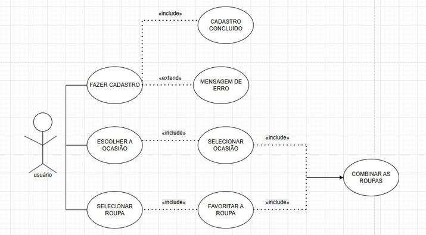
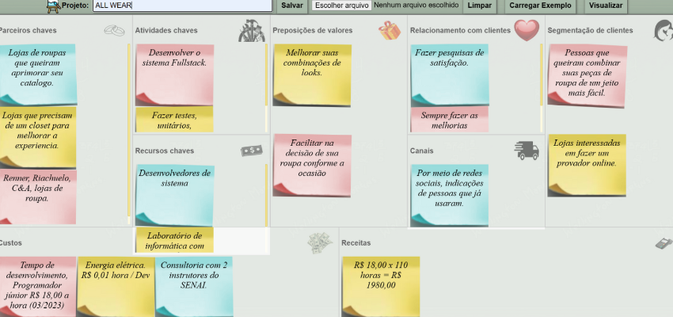
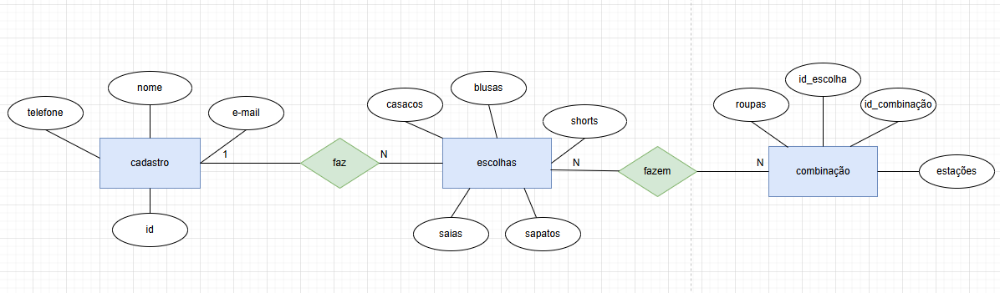
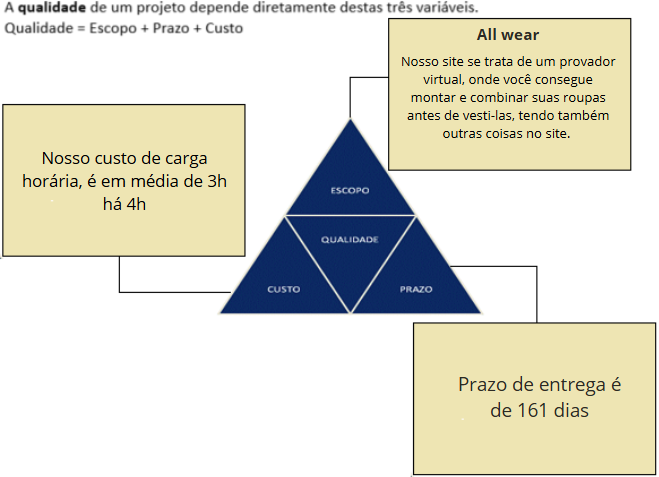

# All Wear (provador virtual)

* Integrantes do Grupo
    - Beatriz Mendes
    - Catarina Silva
    - Kathleen Miranda
    - Laís Andrade

* Usamos o método SCRUM
 

## Diagramas de Casos de Uso

##  Gráfico de Grant

## Modelo Canvas

## (DER)

## (Triângulo de ferro)
   

## (SWOT)

## (Figma)

https://www.figma.com/design/VlNPoD6nSxf5Ei1pDZDGlV/Untitled?node-id=0-1&p=f&t=UQB2mjYxCIxl0Eh7-0

https://www.figma.com/design/VlNPoD6nSxf5Ei1pDZDGlV/Untitled?node-id=0-1&t=cWaBKzPjVCDDKxoB-1